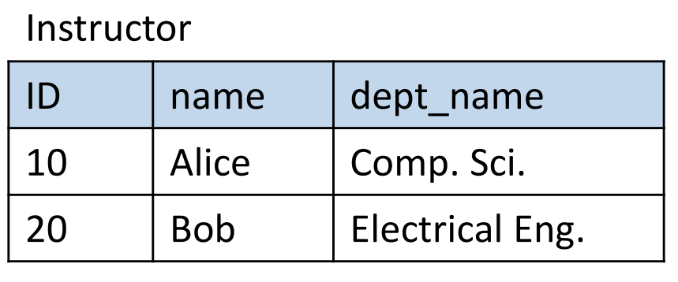
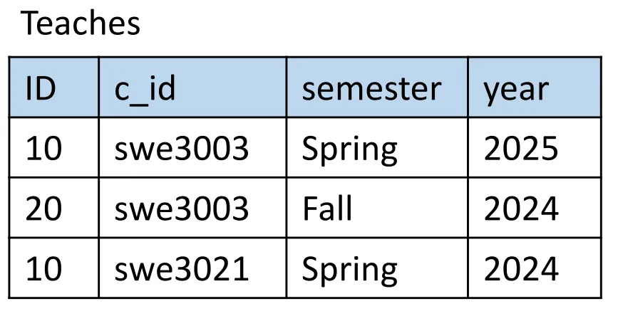
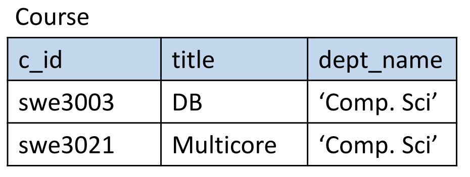

이전에 배운 Relational Model과 관계 대수를 이용하여 SQL을 배웠다

… 

### 1. DDL

data-definition language

- 데이터베이스의 스키마(구조) 를 정의하고 설계하는 언어

- 애플리케이션 단계에서 거의 사용되지 않음

#### 1) create table : table 생성


    - attribute와 도메인 dataType 설정

    - primary key : record들을 구별해주는 attribute로, 해당 도메인 값은 null 불가

    - foreign key : 현재 테이블 (relation)에서는 중요하지 않지만, 다른 테이블에서 key로 역할하고 있음을 설명

#### 2) drop table : table 삭제

     해당 schema 와 content 를 모두 삭제

    cf) delete from table ( dml ) <-> drop table

    contents 모두 삭제하지만, table schema는 유지

#### 3) alter table : 속성 추가 및 삭제

- alter table R add A D: 테이블에 속성 A,D 추가하기

- alter table R drop A: 테이블에 속성 A 제거하기

### 2. DML

- select / insert / update / delete

- set operations

- ordering

- aggregate functions

- nested subquery

#### 1) Select

```sql
SELECT A1,A2,A3... // 속성들 선택
FROM R1,R2,R3...  // 테이블에서 
WHERE P  // 조건을 만족시키는 
```

- 특정 attribute 선택 

- 관계 대수에서 projection 과 동일 (π)

- case insensitive 

- 중복 허용중복을 없애기 위해서는 distinct를 붙여야함

    ```sql
    SELECT distinct dept_name 
    FROM instructors
    ```

- asterick ( * )  : 모든 속성 의미 

    ```sql
    SELECT * FROM instructors 
    ```

- arithmetic instruction 사용가능 ( + , -, * , / ) 

      

    ```sql
    SELECT ID, name, salary/12 FROM ... 
    ```


2)Where : 조건 제시 

- and, or ,not …

- comparison ( < , >, =, … )

```sql
SELECT name FROM instructor 
WHERE dept_name = 'Comp.sci' and salary > 8000
```


3)From : table 

- 테이블들을 콤마로 나열할 경우 → Cartesian Product

```sql
select * from instructor, teaches 
```


        Join 을 구현하는 법

1. 직접 where 조건을 이용하여 구현하기

    ```sql
    select name from instructor, teaches 
    where instructor.id == teaches.id 
    ```

    1. SQL에서 natural join 기능 지원

    ```sql
    select * from instructor natural join teaches
    ```


        Natural Join의 위험성

    공통된 이름을 갖지만, 관련성이 없는 속성으로 인해, 실제 필요한 레코드가 누락되는등의 위험이 존재함.


    
        

                                    
                            
                            
    instructor table 과 teaches table을 natural join 한 후에 course table을 join 한다면??

    ```sql
    select name 
    from instructor natural join teaches natural join course
    ```

    → 마지막에 course 까지 natural join 할때 공통 attribute로 c\_id뿐만 아니라 dept\_name까지 적용된다. 이때 Bob 이라는 사람이 elect.engineering이어서 Bob의 레코드가 사라진다. 

해결책

    ```sql
    select name
    from instructor natural join teaches , course
    where teaches.coures_id = Course.course_id 
    ```


4)String Operations

- string matching : 

    - = : 완전히 일치

    - like : wild char 고려

        - percent % : any substring

        - unserscore _ : single char

    ex) 

    ```sql
    select name from student
    where name like '%dar%'
    ```


5)sorting : Order By

- default : asc 

    ```sql
    select name from student 
    order by name 
    ```

- desc

    ```sql
    select name from student 
    order by name desc
    ```


6)range query and tuple comparison

- where 에서 between 을 사용할 수 있다

    : and 로 조건문 두번 쓰는거 대신으로 

    ```sql
    select name from worker
    where salary between 9000 and 100000
    ```

- tuple comparison

    ```sql
    select name, course_id 
    from instructor, teaches
    where (instructor_id, dept_name) = (teaches.id, 'Biology')
    ```


